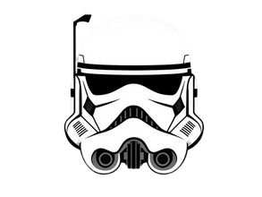
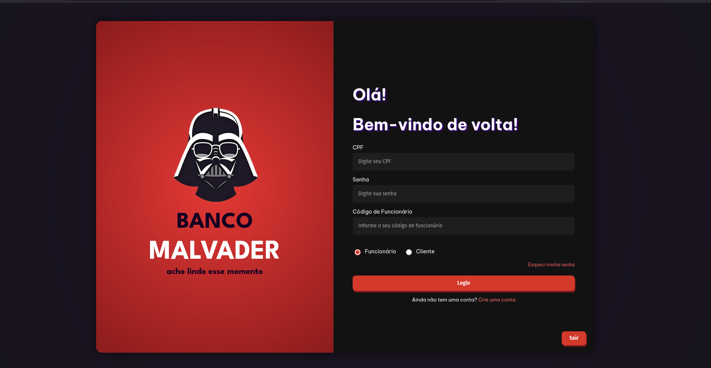

<div align="center">
  <div style="font-size:2.0rem; margin-top: 8px;"><b>Welcome to MALVADER</b></div>
  
</div>


##  Getting Started


Este projeto utiliza [Next.js](https://nextjs.org/) para o frontend.

### Pré-requisitos

- [Node.js](https://nodejs.org/) (recomendado v18 ou superior)
- [npm](https://www.npmjs.com/) ou [yarn](https://yarnpkg.com/) ou [pnpm](https://pnpm.io/) ou [bun](https://bun.sh/)

### Instalando dependências

No diretório do projeto, execute:

```bash
npm install
# ou
yarn
# ou
pnpm install
# ou
bun install
```

### Rodando o servidor de desenvolvimento

```bash
npm run dev
# ou
yarn dev
# ou
pnpm dev
# ou
bun dev
```

O projeto estará disponível em [http://localhost:3000](http://localhost:3000).

---

## Funcionalidades

- Autenticação de usuários e funcionários
- Consulta de saldo, extrato, transferências, depósitos e mais
- Interface responsiva e moderna

---
## Tela inicial:


---


##  Variáveis de Ambiente

Crie um arquivo `.env` na raiz do projeto e configure, por exemplo:

```
NEXT_PUBLIC_API_URL=http://127.0.0.1:8000/api
```

---

##  Build para produção

```bash
npm run build
# ou
yarn build
# ou
pnpm build
# ou
bun build
```

Depois, para rodar em produção:

```bash
npm start
# ou
yarn start
# ou
pnpm start
# ou
bun start
```
---

<br>
<div align="center">
  
  <div style="font-size:1.0rem; margin-top: 8px;"><b>Malvader bank</b></div>
</div>